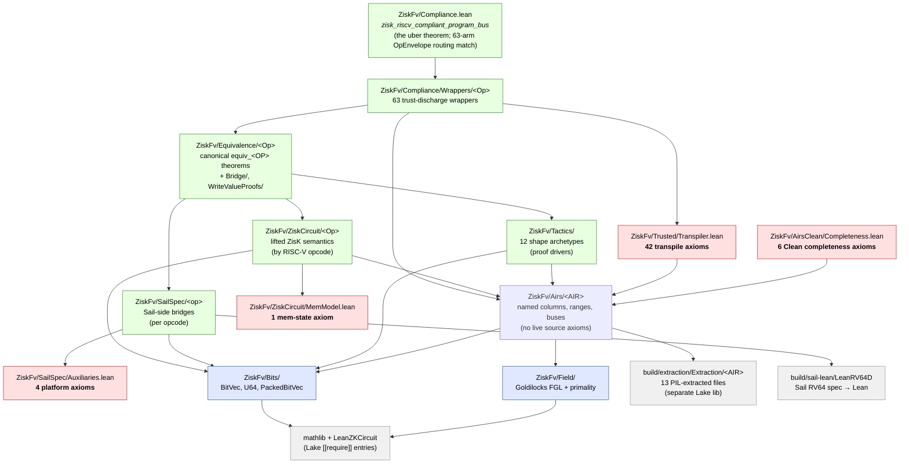

# zisk-fv

⚠️This code has is currently undergoing quality control. It should not be regarded as showing that any version of ZisK's circuits correctly implement the RISC-V ISA standard. ⚠️

Lean 4 formal verification of the [ZisK](https://github.com/0xPolygonHermez/zisk)
zkVM against the [Sail RISC-V specification](https://github.com/rems-project/sail-riscv),
via [`sail-riscv-lean`](https://github.com/NethermindEth/sail-riscv-lean)'s
`LeanRV64D` module. This effort follows the pattern established by [openvm-fv](https://github.com/openvm-org/openvm-fv), and we are grateful to the authors of that library for their excellent work.

**Status:** the verification claim is the global compliance theorem
`ZiskFv.Compliance.zisk_riscv_compliant_program_bus`
(in `ZiskFv/Compliance.lean`), which dispatches all
63 RV64IM opcodes through a 63-arm `OpEnvelope` sum type to per-opcode
`equiv_<OP>` wrappers, each discharging its canonical
`equiv_<OP>` theorem's promise hypotheses from the trust ledger. The
source trust ledger currently records **53 axioms across 4 files / 8
classes**: 42 transpile contracts, 1 memory-state load bridge, 4
platform-scope assumptions, and 6 Clean-component completeness
placeholders. The live global compliance theorem's closure contains 50
names; the 6 Clean completeness placeholders are documented
non-security-critical completeness-direction axioms and may be absent
from the soundness closure. Full per-class rationale is in
`docs/fv/trusted-base.md`. Closure is mechanically enforced: the V2
gate `check-closure-vs-baseline` asserts that
`#print axioms zisk_riscv_compliant_program_bus` matches
`trust/baseline-zisk-riscv-compliant.txt`, while
`trust/baseline-axioms.txt` is the hashed source-line ledger. The
load-bearing claim is
`lake build`: every per-opcode equivalence theorem + every wrapper +
the uber theorem typechecks. Run `nix run .#test` for the full suite
(cargo + lake + trust gate V1 + V2 + flake repro check).

## Layout

| Path                   | Purpose                                                                                                |
| ---------------------- | ------------------------------------------------------------------------------------------------------ |
| `docs/fv/`             | Trust ledger ([`trusted-base.md`](docs/fv/trusted-base.md) narrative + [`axiom-index.md`](docs/fv/axiom-index.md) flat per-axiom table), extractor contract, AIR inventory |
| `tools/pil-extract/`   | Rust CLI: decodes `.pilout` protobuf → Lean constraint definitions                                     |
| `ZiskFv/`              | Lake 4 package (mathlib + LeanZKCircuit + LeanRV, toolchain v4.28.0). See [Inside `ZiskFv/`](#inside-ziskfv) below. |
| `zisk/`                | ZisK source tree (git submodule, pinned at `48cf7ccef`)                                                |
| `trust/`               | Trust-boundary baselines + enforcement scripts. See `trust/README.md`.                                 |
| `flake.nix`, `nix/`    | Nix flake that builds the pilout + Sail-Lean spec + extracted Lean reproducibly. See `nix/README.md`.  |
| `build/`               | Generated artifacts. Gitignored — produced by `nix run .#populate`. See [Inside `build/`](#inside-build) below. |
| `docs/site/`           | Single-page trust-boundary explainer (run `docs/site/serve.sh`, port 4044).                            |

## Two pipelines

The project has two distinct pipelines a reader has to keep in mind:
the **build pipeline** (how the inputs become the artifacts the proofs
read) and the **reasoning pipeline** (how, given those artifacts, the
proofs build up to the global theorem). They are illustrated below
side-by-side; the file map after this section labels each box with the
directory it lives in.

### Build pipeline

```
flake.lock          ← single audit surface for build inputs
  │                   (sail, sail-riscv, zisk, pil2-*, nixpkgs all
  │                    content-hash pinned)
  ▼
nix run .#populate
  ├──▶ build/sail-lean/           ← Sail RV64 spec compiled to Lean
  │                                 (~149 files, defines LeanRV64D.Functions.execute)
  ├──▶ build/zisk.pilout          ← PIL2 constraint set (protobuf, ~17 GiB peak build)
  │       │
  │       │ tools/pil-extract  (Rust, decodes protobuf → Lean)
  │       ▼
  └──▶ build/extraction/          ← separate Lake library `Extraction`
        Extraction/<AIR>.lean       (13 files: Arith, Binary, BinaryAdd,
                                     BinaryExtension, Buses, Main, Mem,
                                     MemAlign{,Byte,ReadByte,WriteByte},
                                     MemoryBuses, ArithTable)
  │
  ▼
lake build      ← the FV check. Reads sail-lean + Extraction via
                  lakefile.toml `[[require]]` entries; typechecks
                  the entire ZiskFv tree atop them.
```

The `Extraction` library is a separate Lake package required from
the root lakefile via `[[require]] name = "Extraction" path = "build/extraction"`.
Its 13 auto-generated `.lean` files declare anonymous
`constraint_N_every_row` predicates directly over witness columns;
the human-readable wrappers and single-AIR correctness theorems live
in `ZiskFv/Airs/<AIR>/`. Without `nix run .#populate` having
populated `build/extraction/`, the `lakefile.toml` require fails
and `lake build` cannot start.

### Reasoning pipeline

```
build/sail-lean/                       build/extraction/Extraction/
  LeanRV64D.Functions.execute            constraint_N_every_row predicates
        │                                          │
        │ rewritten to clean BitVec/Option         │ wrapped with named-column
        │ form by ZiskFv/SailSpec/<op>             │ accessors by ZiskFv/Airs/<AIR>
        ▼                                          ▼
  PureSpec.execute_<op>_pure              Valid_<AIR> records + iff-bridges
  + equivalence lemma to LeanRV64D        + single-AIR correctness theorems
        │                                          │
        │                                          │ + bus-protocol soundness axioms
        │                                          │   (operation bus, memory bus,
        │                                          │    range bus, lookup tables)
        │                                          ▼
        │                                  ZiskFv/ZiskCircuit/<Op>.lean
        │                                  lifted per-opcode circuit semantics
        │                                  (composes the relevant AIR rows via
        │                                   matches_entry on the operation bus)
        │                                          │
        └──────────── join ────────────────────────┘
                         │
                         ▼
        ZiskFv/Equivalence/<Op>.lean           ZiskFv/Tactics/<Shape>Archetype.lean
        equiv_<OP> : LHS = RHS                 packaged simp/rewrite cascade per
        (LHS = Sail execute,                    instruction shape; per-opcode files
         RHS = bus_effect …)                    instantiate the matching archetype.
        Takes promise hypotheses
        (TRANSPILE-BRIDGE, RANGE, etc.)
                         │
                         │  discharged by ZiskFv/Trusted/Transpiler.lean
                         │  + source trust in ZiskFv/Trusted/Transpiler,
                         │  ZiskFv/ZiskCircuit/MemModel,
                         │  ZiskFv/SailSpec/Auxiliaries, and
                         │  ZiskFv/AirsClean/Completeness
                         │  (53 source axioms total — see docs/fv/trusted-base.md)
                         ▼
        ZiskFv/Compliance/Wrappers/<Op>.lean
        equiv_<OP>    ← 63 wrappers, one per RV64IM opcode
                         │
                         ▼
        ZiskFv/Compliance.lean
        zisk_riscv_compliant_program_bus      ← THE verification claim
        (uber theorem; 63-arm OpEnvelope routing match;
         #print axioms closure ≡ trust/baseline-axioms.txt)
```

### Component-level dependency graph



**Reading the graph.** Arrows point in the *import* direction: A → B
means "A imports / depends on B." Red boxes carry source axioms (53
total: 42 in `Trusted/Transpiler.lean`, 6 completeness-direction
placeholders in `AirsClean/Completeness.lean`, 1 in
`ZiskCircuit/MemModel.lean`, and 4 in `SailSpec/Auxiliaries.lean`).
Grey boxes are external (built or pulled outside the Lake package).
Green boxes are pure-proof. The `Trusted → Airs` edge looks
backwards but is correct — `Transpiler.lean` references `Airs/Main/Main`
to phrase its `transpile_<OP>` axioms over `Valid_Main`-row witnesses
(its axioms are *about* Main rows). All paths from `Compliance` reach
either a red box (a trust commitment) or one of the two `build/...`
external nodes (Sail spec or extracted PIL); the rest is pure proof.

`lake build` succeeding **is** the formal-verification claim: every
typed name above checks against the 50-name global compliance closure in
`trust/baseline-zisk-riscv-compliant.txt` and the 53 source axioms in
`trust/baseline-axioms.txt` (plus Lean 4's kernel and the LeanRV64D
Sail translation — see [trusted-base.md](docs/fv/trusted-base.md)).
The V2 trust gate's `check-closure-vs-baseline` subcommand asserts
that the live closure equals the baseline exactly, catching both
silent additions and dead trust.

## Inside `ZiskFv/`

```
ZiskFv/
├── Compliance.lean      ← THE uber theorem zisk_riscv_compliant_program_bus
├── Compliance/          63 equiv_<OP> wrappers under
│   └── Wrappers/<Op>     Wrappers/<Op>.lean (one per RV64IM opcode)
├── Equivalence/         per-opcode canonical equiv_<OP> theorems (65 files)
│   ├── <Op>.lean          + Bridge/ (cross-AIR equivalence machinery)
│   ├── Bridge/            + WriteValueProofs/ (shared rd-value derivations)
│   └── WriteValueProofs/
├── ZiskCircuit/         per-opcode lifted circuit semantics (62 files, by opcode)
├── SailSpec/            per-opcode Sail-side mirrors + bus_effect (65 files)
├── Airs/                per-AIR named-column wrappers (by ZisK AIR, not by opcode)
│   ├── Main/, Binary/,    + Airs/Tables/ for Binary/BinaryExtension lookup proofs,
│   │   Arith/, MemoryBus/,  Airs/{Operation,Memory}Bus/ for channel bridges,
│   │   OperationBus/        Airs/Bus/ for the bus-emission ADT
│   ├── Tables/, Bus/      and the generic bus-interaction structure.
│   └── Mem*.lean
├── Tactics/             instruction-shape archetype tactics (12 files)
├── Field/               Goldilocks field + primality certificate
├── Bits/                BitVec / U64 / PackedBitVec lemmas (foundational)
├── Trusted/             Transpiler.lean — declares 42 transpile_* axioms (class #1)
└── ZiskFv.lean          root module — imports the whole tree
```

Each subdirectory has a short `README.md` orienting the reader; the
sections below summarise.

### `ZiskFv/Compliance.lean` and `ZiskFv/Compliance/`

The verification claim. `Compliance.lean` declares
`zisk_riscv_compliant_program_bus` and proves it by case-splitting on
a 63-arm `OpEnvelope` sum type (one constructor per RV64IM opcode).
Each arm calls the matching per-opcode wrapper
`Compliance/Wrappers/<Op>.equiv_<OP>` (63 wrappers, one
per RV64IM opcode). The wrappers are where each
opcode's canonical `equiv_<OP>` theorem has its promise hypotheses
discharged from the trust ledger — they make the uber-theorem's
parameter surface trust-ledger-only.

The wrapper layer's caller burden is drift-guarded by
`trust/baseline-wrapper-caller-burden.txt`; the uber theorem's
transitive axiom closure is drift-guarded by
`trust/baseline-zisk-riscv-compliant.txt` (per-name flat list) and
`trust/baseline-axioms.txt` (hashed per-axiom ledger).

### `ZiskFv/Equivalence/`

Per-opcode canonical theorems, one file per RV64IM opcode (e.g.
`Add.lean`, `Beq.lean`, `Ld.lean`), containing
`equiv_<OP> : execute_instruction (.<shape> …) state = (bus_effect exec_row mem_row state).2`.
Both sides live in Sail's state space (LHS is `LeanRV64D.Functions.execute`,
RHS is `SailSpec.BusEffect.bus_effect`). Each theorem takes promise
hypotheses in a fixed set of safe trust classes — `CIRCUIT-CONSTRAINT`,
`LANE-MATCH`, `RANGE`, `TRANSPILE-BRIDGE`, `TRANSPILE-PIN` — uniformly
enforced by the V1 + V2 trust gates against
`trust/forbidden-param-shapes.txt` and `trust/forbidden-types.txt`
(no carve-outs; the 7 load opcodes were closed by deriving their
cross-entry rd-value equations from circuit witnesses in
`ZiskCircuit/LoadDerivation.lean` + `ZiskCircuit/SextLoadBridge.lean`).

`Bridge/` factors cross-AIR machinery (control-flow, memory, state,
binary-add, binary, binary-extension, arith) shared by many opcodes.
`WriteValueProofs/` factors shared rd-value derivations across
opcode families that share a pattern (arith, binary-compare,
binary-logic, binary-shift, jump/utype, mul/div/rem signed/unsigned,
sail-bridge).

### `ZiskFv/ZiskCircuit/`

Per-opcode lifted ZisK circuit semantics — one file per RV64IM
opcode (62 files including shared infrastructure like `MemModel.lean`,
`LoadDerivation.lean`, `SextLoadBridge.lean`). Each file composes the
relevant `Airs/` pieces via the operation-bus abstraction
(`Airs/OperationBus/OperationBus.lean::matches_entry`) and concludes
that the involved AIR rows together produce `f(inputs)` for some
BitVec function `f`. The math stays in `Fin p` (Goldilocks); the
BitVec-to-Sail-state lift itself happens in `Equivalence/`. Organised
**by RISC-V opcode**, not by AIR — `ZiskCircuit/Add.lean` projects out
the Add behaviour from `Airs/Main/Main.lean` +
`Airs/Binary/BinaryAdd.lean`, joined by their matching bus row.

### `ZiskFv/SailSpec/`

Per-opcode Sail-side mirrors (lowercase, one per opcode: `add.lean`,
`lw.lean`, …, 65 files = 63 opcodes + `Auxiliaries.lean` +
`BusEffect.lean`). Each opcode file does two jobs:

1. **Defines a pure version** in `PureSpec` namespace — the
   Sail-extracted `execute_instruction` rewritten in clean
   `BitVec`/`Option` terms, monad stripped, decoder dispatch removed,
   ZisK-irrelevant trap arms eliminated via the four platform axioms in
   `Auxiliaries.lean` (PMP/CLINT/PMA inert, Zicfilp disabled — all
   scope-honest for ZisK's RV64IM target, ledger classes #7–#10).
2. **Proves an equivalence lemma**
   `execute_<OP>_pure_equiv : LeanRV64D.Functions.execute … = PureSpec.execute_…_pure …`.
   The lemma keeps the pure form honest — drift between
   `build/sail-lean/` and the pure form is a build failure, not a
   silent trust extension.

`BusEffect.lean` defines the `bus_effect` function that produces a
Sail-shaped state update from circuit-side rows — this is the RHS
of every equivalence theorem.

### `ZiskFv/Airs/`

The per-AIR layer. For each ZisK AIR (`Main`, `Binary`, `BinaryAdd`,
`BinaryExtension`, `Arith`, `Mem`, `MemAlign{,Byte,ReadByte,WriteByte}`)
this layer provides:

- **`Valid_<AIR>` structures** naming each column (so `m.cout_1 row`
  instead of `Circuit.main circ (column := 9) (row := row) (rotation := 0)`),
  with `_def` lemmas tying the names back to the underlying anonymous
  accessors in `Extraction.<AIR>`;
- **iff-bridges** that turn each anonymous `constraint_N_every_row`
  into a meaningfully-named predicate (e.g. `core_every_row` for
  BinaryAdd's carry chain);
- **single-AIR correctness theorems** — proofs that one AIR's
  constraints, in isolation, imply the `BitVec` relation they claim.
  These are the heaviest files in the layer:
  `Binary/BinaryPackedCorrect.lean` is ~2,100 lines,
  `Binary/BinaryExtensionPackedCorrect.lean` is ~2,800;
- **bus-protocol machinery** under `Airs/OperationBus/` (operation-bus
  channels and bridges), `Airs/MemoryBus/` (memory-bus channels and
  MemAlign bridges), `Airs/Bus/` (bus-emission ADT +
  generic bus-interaction structure);
- **lookup-table and range proofs** under `Airs/Tables/` and per-AIR
  support files. The former bus, lookup, and range soundness axioms in
  this layer have been retired from the live source ledger.

Files are organised **by ZisK constraint table**, not by RISC-V
instruction — a single AIR (e.g. `Binary`) covers many opcodes (ADD,
SUB, AND, OR, XOR, branches, …).

The axiom-bearing files are exactly the four paths allowed by
`trust/allowed-axiom-files.txt`: `Trusted/Transpiler.lean` (42),
`AirsClean/Completeness.lean` (6 non-security-critical completeness
placeholders), `ZiskCircuit/MemModel.lean` (1), and
`SailSpec/Auxiliaries.lean` (4), for 53 source axioms total.

### `ZiskFv/Tactics/`

Archetype tactics: instruction-shape templates that drive the
per-opcode proofs. The 12 archetypes (`ALURTypeArchetype`,
`ALUITypeArchetype`, `BranchArchetype`, `LoadArchetype`,
`StoreArchetype`, `JumpArchetype`, `MulArchetype`, `ShiftArchetype`,
`SignExtendLoadArchetype`, `RTypeWArchetype`, `UTypeArchetype`,
`ArithSMArchetype`) each package the standard simp/rewrite cascade
for one instruction shape. Per-opcode files under `Equivalence/`
mostly instantiate the relevant archetype with the opcode's specific
Sail-side rewrite and `ZiskCircuit/` compositional theorem.

### `ZiskFv/Field/`, `ZiskFv/Bits/`, `ZiskFv/Trusted/`

Foundational layer.

- `Field/Goldilocks.lean` defines `FGL := Fin (2^64 - 2^32 + 1)` and
  the canonical `[Field FGL]` instance — declared once globally and
  never shadowed (shadowing as a proof-local variable defeats `ring`).
- `Field/GoldilocksPrimality.lean` is the Pratt-style primality
  certificate; uses `native_decide` (~6 min cold; the slowest single
  proof in the build).
- `Field/GoldilocksBridge.lean` ties the Mathlib `Field`/`ZMod`
  formalisation to `Fin p` used elsewhere.
- `Bits/U64.lean` and `Bits/PackedBitVec/` hold the fixed-width
  arithmetic lemmas needed for carry-free decompositions across
  packed lanes; `Bits/BitVec.lean` (top-level) carries the bridge
  lemmas. `Bits/Execution.lean` defines the generic execution-trace
  structure.
- `Trusted/Transpiler.lean` declares the **51 `transpile_*` axioms**
  (class #1) that bridge RISC-V instruction encoding to ZisK's
  microinstruction format, plus the platform-scope axioms (P1–P4)
  and `store_pc=1` PC bridges (TP-*). The namespace
  `ZiskFv.Trusted` reflects the trust-surface status — this is the
  largest single axiom block.

## Inside `build/`

```
build/
├── sail-lean/      Sail RV64 spec compiled to Lean (LeanRV64D module). ~149 generated files.
├── extraction/     Lake lib `Extraction` — auto-generated PIL2 extraction (13 per-AIR files).
└── zisk.pilout     Compiled ZisK constraint set (protobuf). The pil-extract input.
```

Everything under `/build/` is regenerated by `nix run .#populate` from
flake-pinned inputs and is gitignored. The audit surface for these
artifacts is `flake.lock` (content-hashed pins of the Sail compiler,
sail-riscv source, ZisK source, and `pil2-*` toolchain), not the files
themselves.

### `build/sail-lean/`

The Sail RV64 spec mechanically compiled to Lean by
[`NethermindEth/sail-riscv-lean`](https://github.com/NethermindEth/sail-riscv-lean)
(149 files). Defines `LeanRV64D.Functions.execute`, the monadic decoder
that pattern-matches every RV64GD instruction, plus all supporting types
(registers, memory model, traps, PMP, CLINT, …). This is the **trusted
source of truth** for the LHS of every equivalence theorem; per-opcode
ergonomic mirrors live in `ZiskFv/SailSpec/`.

### `build/extraction/`

A standalone Lake library named `Extraction`, required by the root
`lakefile.toml` via `[[require]] path = "build/extraction"`. Contains
the 13 auto-generated per-AIR `.lean` files emitted by
`tools/pil-extract` from `build/zisk.pilout`: `Arith`, `ArithTable`,
`Binary`, `BinaryAdd`, `BinaryExtension`, `Buses`, `Main`, `Mem`,
`MemAlign`, `MemAlignByte`, `MemAlignReadByte`, `MemAlignWriteByte`,
`MemoryBuses`. Each file defines anonymous `constraint_N_every_row`
predicates directly over witness columns; the human-readable named
wrappers live in `ZiskFv/Airs/<AIR>/`. The static `lakefile.toml` and
root `Extraction.lean` are written into the directory by
`nix/populate.nix` (they aren't part of any Nix derivation), so wiping
`build/` and re-running populate restores the full lib.

### `build/zisk.pilout`

The ZisK PIL2 constraint set in protobuf form, the output of `pil2-compile`
applied to ZisK's `.pil` source tree. Input to `tools/pil-extract` (which
produces `build/extraction/Extraction/*.lean`). At ~17 GiB peak / ~24 min
wall on cold rebuild, this is the dominant cost in the `populate` pipeline.

## Trust gate (CI)

The trust boundary is **mechanically enforced** on every PR via
`.github/workflows/trust-gate.yml`, which runs both layers:
`trust/scripts/check-all.sh` (V1, 9 syntactic checks, no build) and
`trust/scripts/check-all-semantic.sh` (V2, 3 semantic checks, requires
`lake build`). Together they ensure:

**V1 (9 checks, syntactic):**

- All `axiom` / `opaque` / `constant` / `unsafe def` / `partial def`
  / `@[extern]` / `@[implemented_by]` declarations live in one of the
  files listed in `trust/allowed-axiom-files.txt`.
- The hash + name + location of every project axiom matches
  `trust/baseline-axioms.txt`. Any add, remove, rename, or subtle
  weakening of an axiom shows up as a diff on this file.
- No canonical `equiv_<OP>` theorem accepts a retired OUTPUT-EQ
  hypothesis parameter (`h_rd_val`, `h_byte_sum`, etc. — see
  `trust/forbidden-param-shapes.txt`); uniformly enforced across all
  63 opcodes (no carve-out).
- Sanity floors on axiom count (≥ 82) and canonical-theorem count
  (≥ 63), plus cross-witness check.
- Zero `sorry` under `ZiskFv/{Field,Bits,Trusted,Airs,ZiskCircuit,Equivalence,Compliance,Tactics,SailSpec}`.
- Uniformity: every one of 63 RV64IM opcodes has a canonical
  `equiv_<OP>`.
- Anti-laundering tripwires: per-theorem hypothesis count + canonical
  caller-burden ledger + wrapper caller-burden ledger all
  drift-guarded against their respective baselines.

**V2 (3 checks, semantic — `lake exe trust-gate`):**

- **Per-theorem axiom closure** (`baseline-equiv-axiom-deps.txt`):
  transitive non-kernel axiom dependencies of every canonical
  `equiv_<OP>` recorded; any silent change (additions OR removals)
  fails the gate.
- **Forbidden binder types** (`forbidden-types.txt`): walks each
  canonical theorem's binders via `forallTelescope` + `whnfR`,
  catching the `abbrev`-aliasing dodge V1's regex misses.
- **Closure vs baseline**: transitive project-axiom closure of
  `ZiskFv.Compliance.zisk_riscv_compliant_program_bus` must equal the
  set of names in `baseline-axioms.txt` exactly. Catches **dead
  trust** (axioms hash-fresh in the ledger but no longer reachable
  from the uber theorem).

To legitimately extend the trust surface, edit the relevant allowlisted
file, run `trust/scripts/regenerate.sh`, commit the updated baselines
(`baseline-axioms.txt`, `baseline-zisk-riscv-compliant.txt`,
`baseline-equiv-axiom-deps.txt`), and have a CODEOWNER review the
diff (these files are protected by `.github/CODEOWNERS`). See
`trust/README.md` for the full process and `CLAUDE.md` for guidance
to AI agents contributing to this repo.

Run `trust/scripts/check-all.sh` locally (V1, no build) and
`trust/scripts/check-all-semantic.sh` after `lake build` (V2) to see
what CI will check; `nix run .#test` runs both in sequence.

## First-time setup — build the spec + pilout

zisk-fv reads two artifacts that aren't checked into the repo: the
Sail-Lean RV64D **spec** (the Lean translation of the official Sail
RISC-V specification, which is what the proofs are _about_) and the
ZisK pilout (compiled constraint set, which is what the proofs are
_checked against_). **Both are built locally from primary source via
Nix** — nothing is pulled pre-built. Requires Nix with flakes
enabled; one-time install:

```bash
curl --proto '=https' --tlsv1.2 -sSf -L \
  https://install.determinate.systems/nix | sh -s -- install
```

Then, once after cloning:

```bash
nix run .#populate    # ~30 min cold; ~seconds warm via Nix store cache
                       # produces build/sail-lean/, build/zisk.pilout,
                       # and build/extraction/Extraction/*.lean
```

The artifacts persist under `build/`, reused
on every subsequent `lake build`. Re-run only when `flake.lock` or any
`nix/*.nix` file changes (in which case the rebuild is incremental
via the Nix store).

The lakefile points at `build/sail-lean/` via a path-based require,
so `lake build` reads the locally-built spec — there is no upstream
git dep for the spec to drift against. The audit surface for build
inputs is **`flake.lock`**: it pins every transitive dependency
(sail/sail-riscv/zisk/pil2-* sources + nixpkgs revision) by content
hash, so the build is deterministic across machines.

## Vendored ZisK inputs

The ZisK tree is pulled in as a git submodule at `zisk/`,
pinned to `0xPolygonHermez/zisk@48cf7ccef` (`Merge pull request #875
from 0xPolygonHermez/develop`). Clone with
`git clone --recurse-submodules` or run `git submodule update --init`
after cloning. The submodule is the source-text reference for
`transpile_*` axiom rationales; the pilout itself is built by the
flake from a separate pinned commit of upstream zisk (see
`flake.nix::inputs.zisk-src`).

## Getting started

After the first-time `nix run .#populate` (above), three commands cover
everything:

```bash
nix run .#populate                # refresh artifacts (cached after first build)
nix develop --command lake build  # the FV check
nix run .#test                    # full test suite
```

Or enter the devshell once and run `lake build` without the `nix
develop` prefix:

```bash
nix develop
lake build
```

`lake build` succeeding **is** the formal-verification claim. Everything
in `nix run .#test` past `lake build` (cargo unit tests, trust gate,
flake repro check) is auxiliary scaffolding around that core proof
check.

First cold `lake build` takes roughly 10 minutes, dominated by
`native_decide` on Goldilocks primality (`Field/GoldilocksPrimality.lean`).
The devshell provides `cargo`, the Lean toolchain (`elan`), python3,
and jq — the same toolchain `nix run .#test` bundles.

## Resource requirements

Cold first-time `nix run .#populate` (no Cachix hits, empty Nix
store) is bounded by the pilout build:

| Step                              | Peak RAM   | Wall time  |
|-----------------------------------|------------|------------|
| `.#zisk-pilout` (cold rebuild)    | ~17 GiB    | ~24 min    |
| `lake build` worst process (`SailSpec/sd.lean`) | ~8 GiB RSS / ~7 GiB PSS | (subset of total `lake build`) |
| Everything else                   | < 5 GiB    | minutes    |

The pilout build dominates because `pil2-compiler` (Node, V8 heap
capped at 12 GiB) composes every AIR's algebraic constraints in one
process; total RSS hits ~16 GiB plus OS overhead. **A 16 GiB machine
cannot run the cold pilout build** — 32 GiB is the practical minimum.
CI runs on `size-xl-x64` (32 GiB).

Once the pilout is in the local Nix store or Cachix, every subsequent
`nix run .#populate` is a few-second cached download (~5 MB) with
trivial RAM cost. The 17 GiB ceiling only matters when a `flake.lock`
input changes (i.e. an upstream version bump).

## Build cache architecture

Three independent cache layers, each with a different scope:

| Layer                         | Caches                              | Scope                                                                   | Eviction                                  |
| ----------------------------- | ----------------------------------- | ----------------------------------------------------------------------- | ----------------------------------------- |
| **Cachix** (`zisk-fv.cachix.org`) | Nix derivations: `sail-lean-tree`, `zisk-pilout`, `extracted-lean` | Content-addressed; visible to every machine + CI run                    | Manual; near-permanent in practice         |
| **GitHub Actions cache**      | `.lake/` (compiled oleans for ZiskFv) | Per `refs/<branch-or-PR>/` ref; PR runs read their own ref + `main`'s | 7 days idle; 10 GB total per repo         |
| **Lake's Azure cache**        | Mathlib oleans (via `lake exe cache get`) | Public; content-addressed by Mathlib commit                             | Effectively never                          |

Together these mean a steady-state PR run sees: cachix HIT on all
flake outputs (no pilout rebuild), GitHub-cache HIT on `.lake` (no
ZiskFv re-elaboration), Azure HIT on mathlib (no Mathlib compile).
Cold cost is paid only when a flake input changes (cachix miss) or
when no PR has touched main in over a week (GitHub-cache miss).

### Why not a Nix-cached `lake build`?

The community project [`lean4-nix`](https://github.com/lenianiva/lean4-nix)
provides `lake2nix.mkPackage`, which builds Lake projects as content-
addressed Nix derivations and pushes results to Cachix. This would
replace the GitHub-Actions `.lake` cache with a per-content-hash one
(no 7-day eviction, no per-ref scoping). We considered it and
deliberately stayed with stock Lake. Two reasons:

1. **It would lose Mathlib's Azure cache.** `lake exe cache get`
   pulls Mathlib's oleans (multi-GB) directly from Mathlib's CI cache;
   under `lean4-nix` we'd either have to package Mathlib as a Nix
   derivation (full rebuild on every Mathlib bump, hours) or skip the
   cache and accept ~10 min cold compile per Mathlib update. The lake
   side is the part of our pipeline that already has a working
   community cache; trading it for our own cache is net negative.
2. **Granularity.** A single `mkPackage` derivation hashes over the
   entire ZiskFv source tree, so any source edit invalidates the
   whole derivation. To approach Lake's per-file incremental rebuild,
   we'd have to split ZiskFv into many derivations and hand-encode
   the import graph — duplicating Lake's bookkeeping in Nix for
   marginal benefit over what we already have.

If we ever do hit real friction (e.g. CI gaps long enough that
`.lake` evicts every time), a much smaller move is to keep stock Lake
and just relocate the `.lake` cache off GitHub Actions to S3/GCS keyed
by `(lake-manifest, lakefile, toolchain, flake.lock)` hashes —
preserves Mathlib's Azure cache, no per-ref scoping, ~30 LoC of glue.
