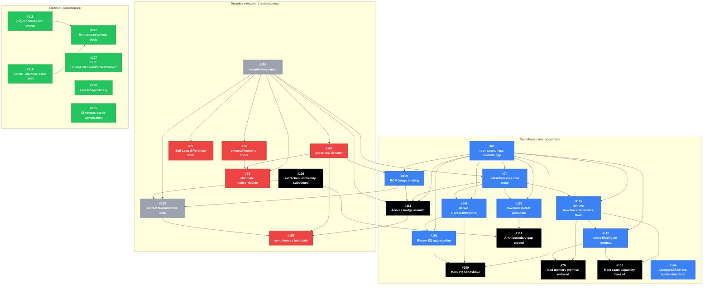

# Issue Dependency Graph

This graph includes all GitHub issues open as of 2026-06-28, plus closed issues
that are explicit predecessors or already-done nodes in the dependency map. Node
colors come from GitHub labels: `soundness`, `completeness`, both labels, no
relevant label, and closed/done.

Arrows preserve the issue-map convention from the seed diagram: `A --> B` means
that `A` is downstream of, decomposed into, or intentionally tracked through `B`.
This is not GitHub's formal blocker metadata, and the graph is not intended to
be a strict DAG.

