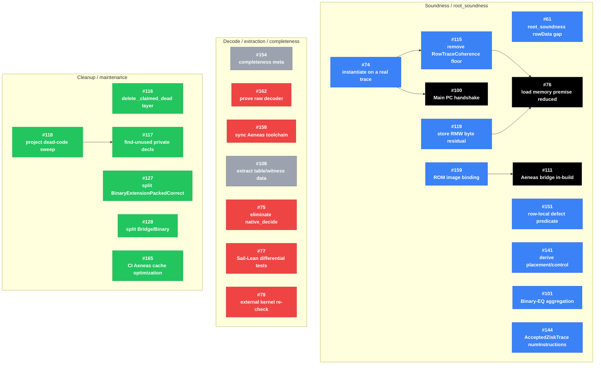

# Issue Dependency Graph

This graph includes all GitHub issues open as of 2026-06-28, plus closed issues
that appear in GitHub's structured issue-dependency data. Node colors come from
GitHub labels: `soundness`, `completeness`, both labels, no relevant label, and
closed/done.

Solid arrows are built from GitHub's structured `blockedBy` / `blocking`
relationships only: `A --> B` means issue `A` is blocked by issue `B`.
Sub-issues are listed separately below because GitHub tracks them as hierarchy,
not dependency edges.

## GitHub Sub-Issues

These structured GitHub relationships are hierarchy/progress tracking, not
`blockedBy` dependencies, so they are not drawn as solid dependency arrows above.

- #61 has sub-issues #74, #100, #101, #111, #115, #141, #151, and #159.
- #115 has sub-issue #119.

No current issue in the queried set has structured `trackedIssues` /
`trackedInIssues` relationships.

## Proposed Dependency Updates

These are not in the graph above unless they are added to GitHub's structured
relationships.

- Add completeness-meta sub-issues under #154 for open completeness/trust work
  such as #108, #162, #75, #77, and #78 if #154 should serve as a GitHub progress
  tracker instead of only a narrative meta issue.
- Add or identify a live issue for the Arith range-table fidelity work, then mark
  #151 as blocked by it. #151 says it is blocked on that work, while the older
  related #114 is already closed.
- Add or identify a live issue for the `mainOfTable` projection/refactor work,
  then mark #144 as blocked by it. #144 names that refactor as the reason the
  `AcceptedZiskTrace numInstructions` cleanup is blocked.
